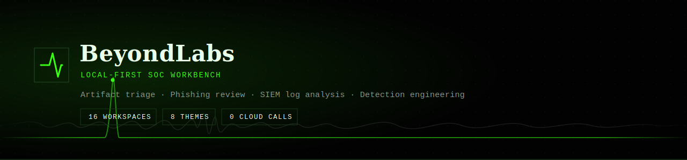
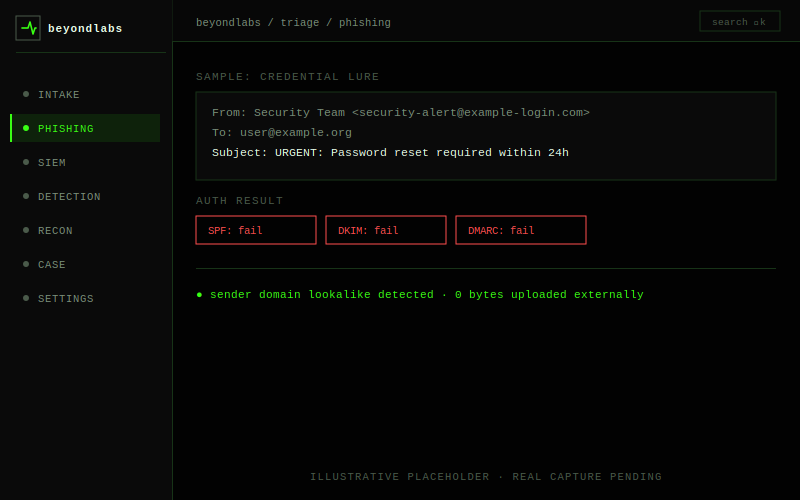
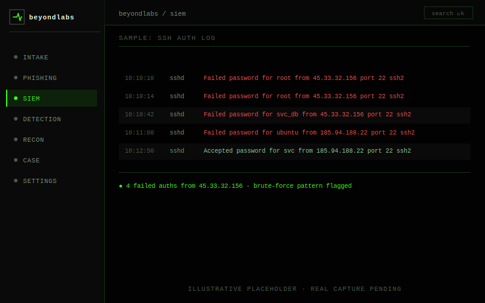
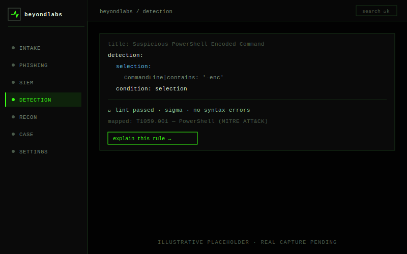
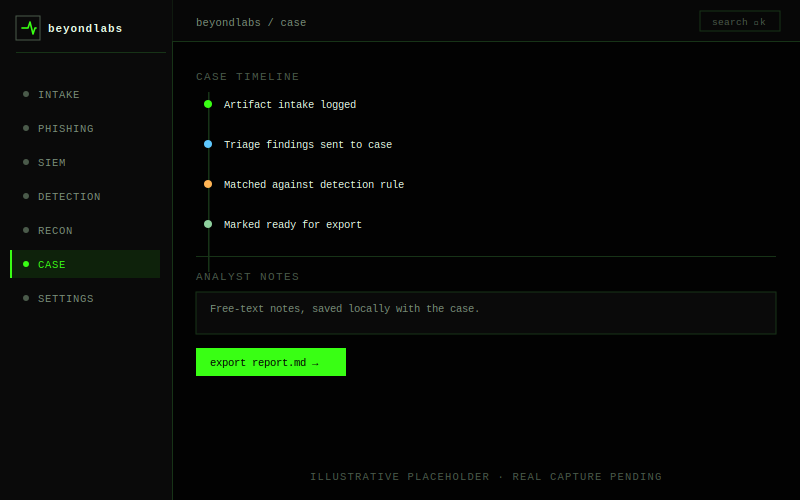
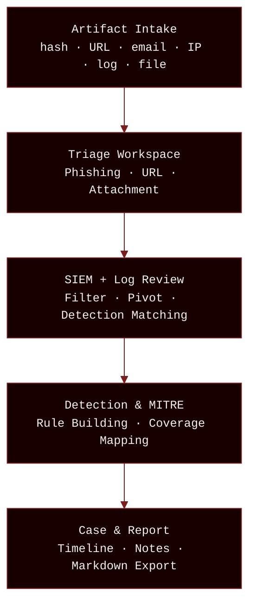
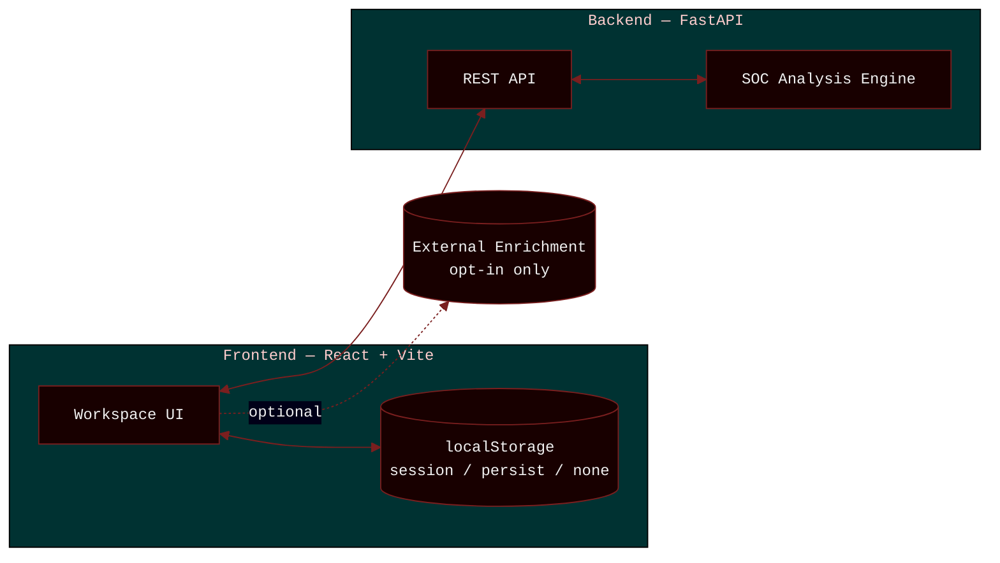

<div align="center">
  
</div>

<div align="center">

<p>
<strong>Artifact triage · Phishing review · SIEM log analysis · Detection engineering</strong><br>
Local-first, privacy-preserving, and analyst-led — sixteen workspaces, one app, your machine.
</p>

[](https://react.dev)
[](https://vite.dev)
[](https://fastapi.tiangolo.com)
[](https://python.org)
[](https://typescriptlang.org)

[](LICENSE)
[]()
[](CONTRIBUTING.md)
[]()

**[Quick Start](#quick-start)** · **[Features](#features)** · **[Architecture](#system-architecture)** · **[Safety Model](#safety-model)** · **[Contributing](CONTRIBUTING.md)**

</div>

---

## Why BeyondLabs

Practicing SOC work usually means one of two bad options: stand up a full lab, or paste live artifacts into someone else's cloud dashboard and hope that's fine. BeyondLabs is a third option — a single local app that covers intake, triage, SIEM review, and detection engineering, and never sends anything off your machine unless you explicitly turn that on.

| | Cloud SOC sandbox | Full VM lab | BeyondLabs |
|---|---|---|---|
| Setup time | Minutes | Hours | Two commands |
| Your artifacts leave your machine | Usually, yes | No | No, by default |
| Cost | Often subscription | Free, but resource-heavy | Free |
| Intake → triage → SIEM → detection → report, one place | Rarely | Depends what you build | Yes |

It's pre-1.0 and under active development. Interfaces and workspace names may still shift between updates — see [Known Limitations](#known-limitations) for what's genuinely rough today.

---

## Table of Contents

- [Why BeyondLabs](#why-beyondlabs)
- [Overview](#overview)
- [Screenshots](#screenshots)
- [Features](#features)
- [Settings & Customization](#settings--customization)
- [Investigation Flow](#investigation-flow)
- [Quick Start](#quick-start)
- [Safety Model](#safety-model)
- [Storage](#storage)
- [Repo Layout](#repo-layout)
- [Health Checks & Demo Workflow](#health-checks--demo-workflow)
- [Development](#development)
- [Host Dependencies](#host-dependencies)
- [Known Limitations](#known-limitations)
- [FAQ](#faq)
- [Contributing](#contributing)
- [Release Checklist](#release-checklist)
- [License](#license)

---

## Overview

BeyondLabs handles artifact intake, phishing triage, SIEM log review, and detection engineering — end to end, on your own machine. It runs on Linux, macOS, and Windows.

| | |
|---|---|
| **Frontend** | React + Vite + TypeScript |
| **Backend** | FastAPI (Python) |
| **Platforms** | Linux · macOS · Windows |
| **Storage** | Local browser only — session / persist / none |
| **License** | MIT |

**What this is not:** a SIEM replacement, an EDR, or a source of verified threat intelligence. It's a practice and triage workbench — see [Safety Model](#safety-model) and [Known Limitations](#known-limitations) for the honest boundaries.

---

## Screenshots

<table>
<tr>
<td align="center" width="50%">
<br/>
<sub><b>Artifact Intake</b> — IOC extraction with defang/refang</sub>
</td>
<td align="center" width="50%">
<br/>
<sub><b>SIEM Workspace</b> — filter, pivot & export</sub>
</td>
</tr>
<tr>
<td align="center" width="50%">
<br/>
<sub><b>Detection Engineering</b> — rule builder with lint & explain</sub>
</td>
<td align="center" width="50%">
<br/>
<sub><b>Case & Report</b> — timeline, notes & markdown export</sub>
</td>
</tr>
</table>

<sub>Illustrative placeholders built from the real sidebar layout, default Terminal Noir theme, and actual sample data in the codebase — not final UI. Swap in real captures once ready.</sub>

---

## Features

**16 workspaces across 5 categories.** Drop into any one on its own, or run the full pipeline end to end.

### Triage & Analysis
| Capability | What it does |
|-----------|-------------|
| **Artifact Intake** | Paste hashes, IPs, URLs, emails — auto-extract IOCs with defang/refang |
| **Phishing Triage** | Analyze email headers, auth (SPF/DKIM/DMARC), URLs, and body signals |
| **Safe URL Analysis** | Static URL dissection — scheme, host, path, params, TLD scoring |
| **Attachment Triage** | Static metadata extraction for common document formats |

### SIEM, Detection & Alerts
| Capability | What it does |
|-----------|-------------|
| **SIEM Workspace** | Paste syslog/JSONL/CSV event streams with filter, pivot, and export |
| **Logs & Alerts** | Parse auth logs, web access logs, IDS alerts, firewall logs |
| **Detection Engineering** | Build Suricata/Snort/Sigma/YARA/KQL rules from templates with lint + explain |
| **MITRE ATT&CK** | Interactive coverage matrix with localStorage persistence |
| **IDS Alerts** | Parse, categorize, and investigate IDS/IPS alert feeds |

### Recon & Toolkit
| Capability | What it does |
|-----------|-------------|
| **Recon & OSINT** | Bounded DNS/whois/nmap workflows for authorized targets |
| **Nmap Runner** | Interactive nmap scan interface with preset profiles and output parsing |
| **Hacking Toolkit** | Curated tool catalog (nmap, metasploit, hashcat, sqlmap, etc.) with preset args and run history |
| **CyberChef / Chef** | Encoding, decoding, hashing, compression, string manipulation |

### Reference & Reporting
| Capability | What it does |
|-----------|-------------|
| **SOC Guide** | Command reference, event ID lookup, detection patterns |
| **Case & Report** | Timeline + analyst notes + markdown report export with handoff chain |

### Workspace
| Capability | What it does |
|-----------|-------------|
| **Settings** | Full workspace customization — see [below](#settings--customization) |

---

## Settings & Customization

| Feature | Details |
|---------|---------|
| **Theme Gallery** | 8 themes: Terminal Noir (default), SOC Console, Editorial Dark, Solar Flare, Synthwave Grid, Late Edition, Broadsheet, Custom |
| **Custom Theme Builder** | Tweak every color token — background, foreground, card, border, accent, surface — with live preview |
| **Accent Presets** | 16+ accent colors across amber, cyan, emerald, fuchsia, indigo, lime, pink, rose, sky, violet, etc. |
| **Typography** | 12+ mono/UI font pairs — JetBrains Mono, Space Grotesk, Inter, Outfit, Geist, IBM Plex Mono, Fira Code, DM Sans, Manrope, Plus Jakarta Sans, Sora, Source Code Pro, Space Mono |
| **Density Control** | Comfortable, Compact, or Ultra-compact spacing |
| **Sidebar** | Pin/unpin workspaces, reorder groups, hide workspaces |
| **Motion & QoL** | Status bar toggle, scroll indicators, copy button visibility |
| **Storage & Backup** | Session-only / Persist / None modes; JSON export/import |

---

## Investigation Flow



Every workspace connects through `beyondlabs.pendingArtifact` — a localStorage handoff channel. Send findings between pages without losing context.

### System Architecture



Frontend and backend talk over a local REST API. Nothing leaves the machine unless external enrichment is explicitly turned on.

---

## Quick Start

Requires Python 3.10+, Node.js 18+, and npm. Pick your platform below.

| URL | Service |
|-----|---------|
| http://127.0.0.1:5173 | Frontend (React + Vite) |
| http://127.0.0.1:8000 | Backend API (FastAPI) |
| http://127.0.0.1:8000/docs | Interactive API docs |

### Linux / macOS

Setup detects your package manager automatically — `pacman` (Arch), `apt` (Debian/Ubuntu), `dnf` (Fedora), or `brew` (macOS).

```bash
./install.sh
./run.sh
```

### Windows

```powershell
.\install.ps1
.\run.ps1
```

### Recommended profile

Pulls in the full recon toolkit (`nmap`, `whatweb`, `subfinder`, `amass`, `httpx`) in one step:

```bash
./install.sh --profile recommended
```

---

## Safety Model

> [!WARNING]
> Recon and scanning tools require explicit confirmation and must only be run against owned, lab, or explicitly authorized targets.

BeyondLabs is designed for defensive analysts who need honest, local signals — not fabricated threat intelligence.

- No malware execution or attachment detonation
- No phishing sending, credential capture, or brute force automation
- Safe URL workflows default to static review
- External enrichment is opt-in — providers show limitations when unavailable, never a faked result
- Browser storage is workspace state, not a secure evidence vault

---

## Storage

| Mode | Behavior |
|------|-----------|
| **Session only** (default) | Cleared when browser closes |
| **Persist** | Restored across browser restarts |
| **None** | No analysis data stored at all |

Change persistence via Settings → Storage & Backup. Export/import JSON case backups there too.

---

## Repo Layout

```
backend/                  FastAPI app — routers, services, SOC analysis engine
frontend/                 React + Vite app — components, pages, lib
├── src/components/       Shared shell, workspace, and UI components
├── src/pages/            Routed workspace pages
├── src/lib/              Analysis engines, stores, routing, local knowledge
├── src/api/              Backend API client layer
scripts/                  Terminal helpers, project checks
install.sh                Linux/macOS setup wizard
run.sh                    Default launcher (backend + frontend)
doctor.sh                 Health checker
reset-workspace.sh        Safe local cache cleanup
demo-workflow.sh          Guided demo path
```

---

## Health Checks & Demo Workflow

```bash
./doctor.sh
```
Runs syntax checks, backend compile, frontend lint/build, and pytest where available.

```bash
./demo-workflow.sh
```
Walks the quick demo route — use any sample button across pages to kickstart it:

```
Artifact Intake → Phishing Triage → Safe URL Analyzer → Logs & Alerts → Detection Workspace → Case & Report
```

---

## Development

<details>
<summary>Backend & frontend setup commands</summary>

```bash
# Backend
cd backend
python3 -m venv .venv
source .venv/bin/activate
pip install -r requirements.txt
uvicorn app.main:app --reload

# Frontend (separate terminal)
cd frontend
npm ci --include=dev
npm run dev
```

Frontend checks:
```bash
npm run lint
npm run build
```

Backend checks:
```bash
python -m compileall app
```

</details>

---

## Host Dependencies

<details>
<summary>Full tool list by category</summary>

| Category | Tools |
|----------|-------|
| Core | `curl`, `openssl`, `file`, `strings`/`binutils`, `jq`, Python `pip`/`venv` |
| DNS/domain | `dig`/`nslookup`, `whois`, `traceroute`, `mtr` |
| Recommended SOC | `nmap`, `whatweb`, `subfinder`, `amass`, `httpx` |
| Optional OSINT | `theHarvester`, `assetfinder`, `waybackurls`, `gau`, `katana` |
| Advanced (opt-in) | `nuclei`, `ffuf`, `gobuster` |

Plain `./install.sh` walks through a guided profile. Optional tools are never installed without confirmation. On Linux, `pacman`/`apt`/`dnf` is detected automatically; on macOS, `brew` is used. Systems without a supported package manager print manual guidance instead of failing. On Windows, use the PowerShell scripts.

</details>

---

## Known Limitations

Current rough edges, and what's planned around them:

| Limitation | Direction |
|---|---|
| Provides local/static triage signals, not absolute threat intelligence verdicts | By design — see [Safety Model](#safety-model) |
| External reputation providers are not faked; unavailable sources show limitations inline | Staying this way — honesty over fake coverage |
| Browser storage is convenient workspace state, not a forensics-grade evidence vault | Use JSON export for anything you need to keep |
| Active scanning must only be used against owned, lab, or explicitly authorized targets | Enforced via explicit confirmation prompts |
| Some frontend pages are intentionally monolithic for stability | Planned split once patterns stabilise |

---

## FAQ

**Does BeyondLabs send my data anywhere?**
No. Analysis runs in your browser and your local FastAPI backend. The only exception is external enrichment, which is opt-in and off by default.

**What platforms are supported?**
Linux, macOS, and Windows — `install.sh`/`run.sh` on Linux/macOS, `install.ps1`/`run.ps1` on Windows.

**Is browser storage safe to use as an evidence store?**
No. It's convenient workspace state, not a forensics-grade evidence vault. Use Settings → Storage & Backup to export case data as JSON if you need to keep it.

**Can I point the recon and scanning tools at any target?**
No. They require explicit confirmation before running and are bounded to owned, lab, or explicitly authorized targets.

**What if I don't want anything persisted at all?**
Set Storage mode to None in Settings — no analysis data is stored.

**Does this replace my SIEM or EDR?**
No. BeyondLabs is a practice and triage workbench, not a production security product. It's built for learning, drills, and first-pass local analysis — not for running your actual detection stack.

**Can I add my own workspace?**
That's the intent behind the modular `src/pages`/`src/lib` split. See [CONTRIBUTING.md](CONTRIBUTING.md) for the current process.

---

## Contributing

Contributions are welcome — this is early enough that useful ones are easy to make an impact with.

- **Found a bug?** Open an issue with repro steps.
- **Have a workspace idea?** The `src/pages` / `src/lib` split is built to make new workspaces addable without touching the rest of the app.
- **Docs unclear or wrong?** Docs PRs are as welcome as code ones.
- **Just want to try it and report friction?** That's genuinely useful too — open an issue.

Full process, style, and setup details live in [CONTRIBUTING.md](CONTRIBUTING.md).

---

## Release Checklist

<details>
<summary>Pre-release commands & checklist (maintainer reference)</summary>

```bash
./doctor.sh
git status --short
```

Confirm:
- No generated dependency/build/cache folders are tracked
- Screenshots are committed or the README intentionally omits them
- README commands match actual scripts
- Optional helper warnings are documented and non-fatal
- Storage/privacy behaviour matches the documented model
- Demo flow works end-to-end: Intake → Analysis → Send to Case → Export

</details>

---

## License

MIT — see [LICENSE](LICENSE) for the full text. Use it, fork it, ship it.

---

<div align="center">

Built for analysts who need local control over their investigation workflow.

If this is useful to you, a ⭐ helps other analysts find it.

[Report Bug](../../issues) · [Request Feature](../../issues) · [Contributing](CONTRIBUTING.md)

</div>
