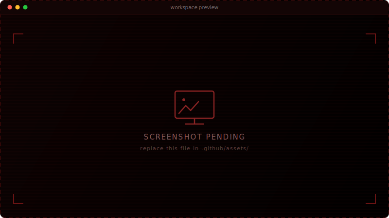
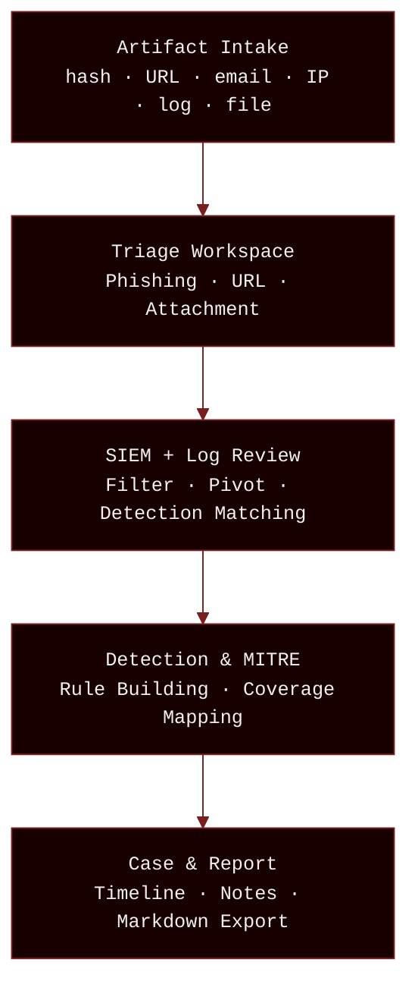
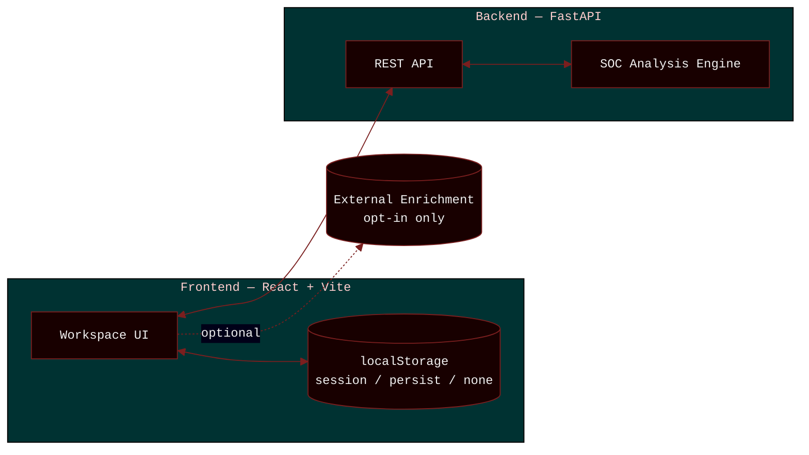

<div align="center">
  
</div>

<div align="center">

### A local-first workbench for defensive analysts.

Artifact triage · Phishing review · SIEM log analysis · Detection engineering — all on your own machine, nothing shipped to a third party unless you say so.

<br>

[](https://react.dev)
[](https://vite.dev)
[](https://fastapi.tiangolo.com)
[](https://python.org)
[](https://typescriptlang.org)

[](LICENSE)
[](CONTRIBUTING.md)
[]()

<p>
<a href="#quick-start"><b>Quick Start</b></a> ·
<a href="#features"><b>Features</b></a> ·
<a href="#architecture">Architecture</a> ·
<a href="#safety-model">Safety Model</a> ·
<a href="#screenshots">Screenshots</a> ·
<a href="CONTRIBUTING.md">Contributing</a>
</p>

</div>

<br>

---

## Table of Contents

- [What This Is](#what-this-is)
- [Why It Exists](#why-it-exists)
- [Screenshots](#screenshots)
- [Features](#features)
- [Settings & Customization](#settings--customization)
- [Architecture](#architecture)
- [Quick Start](#quick-start)
- [Safety Model](#safety-model)
- [Storage](#storage)
- [Repo Layout](#repo-layout)
- [Health Checks](#health-checks)
- [Demo Workflow](#demo-workflow)
- [Development](#development)
- [Host Dependencies](#host-dependencies)
- [Known Limitations](#known-limitations)
- [FAQ](#faq)
- [Release Checklist](#release-checklist)

---

## What This Is

BeyondLabs handles artifact intake, phishing triage, SIEM log review, and detection engineering, end to end, on a machine you control. No lab to stand up, no cloud dashboard to paste artifacts into. Every workspace runs locally, and nothing leaves the machine unless external enrichment is explicitly switched on.

<div align="center">

| | | | |
|:---:|:---:|:---:|:---:|
| **16** | **5** | **3** | **Local** |
| workspaces | categories | supported platforms | first, by default |

</div>

|  |  |
|---|---|
| **Frontend** | React + Vite |
| **Backend** | FastAPI (Python) |
| **Platforms** | Linux · macOS · Windows |
| **Storage** | Browser-local only — session / persist / none |
| **License** | MIT |

---

## Why It Exists

Practicing SOC work usually means one of two things: standing up a full lab, or feeding artifacts into someone else's cloud dashboard. Both are overhead for what should be a fast, repeatable loop — take an artifact, triage it, check it against logs, map it to a detection, write it up.

BeyondLabs collapses that loop into one local workbench. It's built for the analysis itself, not for hosting infrastructure: honest static signals over fabricated verdicts, and a clear, visible line between what happens locally and what (optionally) talks to the outside world.

---

## Screenshots

<table>
<tr>
<td align="center" width="50%">
<br/>
<sub><b>Artifact Intake</b> — IOC extraction with defang/refang</sub>
</td>
<td align="center" width="50%">
<br/>
<sub><b>SIEM Workspace</b> — filter, pivot & export</sub>
</td>
</tr>
<tr>
<td align="center" width="50%">
<br/>
<sub><b>Detection Engineering</b> — rule builder with lint & explain</sub>
</td>
<td align="center" width="50%">
<br/>
<sub><b>Case & Report</b> — timeline, notes & markdown export</sub>
</td>
</tr>
</table>

<sub>Placeholders — swap the files in <code>assets/</code> once real captures are ready.</sub>

---

## Features

16 workspaces across 5 categories. Drop into any one on its own, or run the full pipeline end to end.

### Triage & Analysis

| Workspace | What it does |
|---|---|
| **Artifact Intake** | Paste hashes, IPs, URLs, emails — auto-extracts IOCs with defang/refang |
| **Phishing Triage** | Analyzes email headers, auth results (SPF/DKIM/DMARC), URLs, and body signals |
| **Safe URL Analysis** | Static URL dissection — scheme, host, path, params, TLD scoring |
| **Attachment Triage** | Static metadata extraction across common document formats |

### SIEM, Detection & Alerts

| Workspace | What it does |
|---|---|
| **SIEM Workspace** | Paste syslog / JSONL / CSV event streams; filter, pivot, export |
| **Logs & Alerts** | Parses auth logs, web access logs, IDS alerts, firewall logs |
| **Detection Engineering** | Builds Suricata / Snort / Sigma / YARA / KQL rules from templates, with lint + explain |
| **MITRE ATT&CK** | Interactive coverage matrix, persisted via localStorage |
| **IDS Alerts** | Parses, categorizes, and investigates IDS/IPS alert feeds |

### Recon & Toolkit

| Workspace | What it does |
|---|---|
| **Recon & OSINT** | Bounded DNS / whois / nmap workflows for authorized targets only |
| **Nmap Runner** | Interactive scan interface with preset profiles and output parsing |
| **Hacking Toolkit** | Curated catalog (nmap, metasploit, hashcat, sqlmap, and more) with preset args and run history |
| **CyberChef / Chef** | Encoding, decoding, hashing, compression, string manipulation |

### Reference & Reporting

| Workspace | What it does |
|---|---|
| **SOC Guide** | Command reference, event ID lookup, detection patterns |
| **Case & Report** | Timeline + analyst notes + markdown report export, with handoff chain |

### Workspace

| Workspace | What it does |
|---|---|
| **Settings** | Full workspace customization — see [Settings & Customization](#settings--customization) |

---

## Settings & Customization

| Feature | Details |
|---|---|
| **Theme Gallery** | 7 themes: Aurora Tactical, Terminal Noir, SOC Console, Editorial Dark, Solar Flare, Brutalist Light, Custom |
| **Custom Theme Builder** | Every color token is editable — background, foreground, card, border, accent, surface — with live preview |
| **Accent Presets** | 16+ colors across amber, cyan, emerald, fuchsia, indigo, lime, pink, rose, sky, violet, and more |
| **Typography** | 12+ mono/UI font pairs — JetBrains Mono, Space Grotesk, Inter, Outfit, Geist, IBM Plex Mono, Fira Code, DM Sans, Manrope, Plus Jakarta Sans, Sora, Source Code Pro, Space Mono |
| **Density Control** | Comfortable, Compact, or Ultra-compact spacing |
| **Sidebar** | Pin/unpin workspaces, reorder groups, hide workspaces |
| **Motion & QoL** | Status bar toggle, scroll indicators, copy button visibility |
| **Storage & Backup** | Session-only / Persist / None modes; JSON export and import |

---

## Architecture

### Investigation Flow



Every workspace connects through `beyondlabs.pendingArtifact` — a localStorage handoff channel that carries findings between pages without losing context.

### System Architecture



Frontend and backend talk over a local REST API. Nothing leaves the machine unless external enrichment is explicitly turned on.

---

## Quick Start

Requires Python 3.10+, Node.js 18+, and npm.

```bash
./install.sh
./run.sh
```

| URL | Service |
|---|---|
| `http://127.0.0.1:5173` | Frontend (React + Vite) |
| `http://127.0.0.1:8000` | Backend API (FastAPI) |
| `http://127.0.0.1:8000/docs` | Interactive API docs |

Recommended SOC profile — pulls in the full toolkit (`nmap`, `whatweb`, `subfinder`, `amass`, `httpx`) in one step:

```bash
./install.sh --profile recommended
```

**Linux / macOS** — setup detects your package manager automatically (`pacman`, `apt`, `dnf`, or `brew`):

```bash
./install.sh
./run.sh
```

**Windows:**

```powershell
.\install.ps1
.\run.ps1
```

---

## Safety Model

> [!WARNING]
> Recon and scanning tools require explicit confirmation and must only be run against owned, lab, or explicitly authorized targets.

BeyondLabs is built for honest, local signals — not fabricated threat intelligence.

- No malware execution or attachment detonation
- No phishing sending, credential capture, or brute-force automation
- Safe URL workflows default to static review
- External enrichment is opt-in; providers show their limitations when unavailable
- Browser storage is workspace state, not a secure evidence vault

---

## Storage

| Mode | Behavior |
|---|---|
| **Session only** (default) | Cleared when the browser closes |
| **Persist** | Restored across browser restarts |
| **None** | No analysis data stored at all |

Change persistence via **Settings → Storage & Backup**. Export/import JSON case backups there too.

---

## Repo Layout

```
backend/                  FastAPI app — routers, services, SOC analysis engine
frontend/                 React + Vite app — components, pages, lib
├── src/components/       Shared shell, workspace, and UI components
├── src/pages/            Routed workspace pages
├── src/lib/              Analysis engines, stores, routing, local knowledge
├── src/api/              Backend API client layer
scripts/                  Terminal helpers, project checks
install.sh                Linux/macOS setup wizard
run.sh                    Default launcher (backend + frontend)
doctor.sh                 Health checker
reset-workspace.sh        Safe local cache cleanup
demo-workflow.sh          Guided demo path
```

---

## Health Checks

```bash
./doctor.sh
```

Runs syntax checks, backend compile, frontend lint/build, and pytest where available.

---

## Demo Workflow

```bash
./demo-workflow.sh
```

Quick demo route:

```
Artifact Intake → Phishing Triage → Safe URL Analyzer → Logs & Alerts → Detection Workspace → Case & Report
```

Use any sample button across pages to kick-start a walkthrough.

---

## Development

<details>
<summary><b>Backend & frontend setup commands</b></summary>

```bash
# Backend
cd backend
python3 -m venv .venv
source .venv/bin/activate
pip install -r requirements.txt
uvicorn app.main:app --reload

# Frontend (separate terminal)
cd frontend
npm ci --include=dev
npm run dev
```

Frontend checks:
```bash
npm run lint
npm run build
```

Backend checks:
```bash
python -m compileall app
```

</details>

---

## Host Dependencies

<details>
<summary><b>Full tool list by category</b></summary>

| Category | Tools |
|---|---|
| Core | `curl`, `openssl`, `file`, `strings`/`binutils`, `jq`, Python `pip`/`venv` |
| DNS/domain | `dig`/`nslookup`, `whois`, `traceroute`, `mtr` |
| Recommended SOC | `nmap`, `whatweb`, `subfinder`, `amass`, `httpx` |
| Optional OSINT | `theHarvester`, `assetfinder`, `waybackurls`, `gau`, `katana` |
| Advanced (opt-in) | `nuclei`, `ffuf`, `gobuster` |

Plain `./install.sh` walks through a guided profile. Optional tools are never installed without confirmation. `pacman`/`apt`/`dnf` is auto-detected on Linux, `brew` on macOS; systems without a supported package manager get manual guidance instead of a failure. Windows uses the PowerShell scripts.

</details>

---

## Known Limitations

- BeyondLabs provides local/static triage signals, not absolute threat intelligence verdicts
- External reputation providers are never faked; unavailable sources show their limitations inline
- Browser storage is convenient workspace state, not a forensics-grade evidence vault
- Active scanning must only be used against owned, lab, or explicitly authorized targets
- Some frontend pages are intentionally monolithic for stability, with splitting planned once patterns stabilize

---

## FAQ

<details>
<summary><b>Does BeyondLabs send my data anywhere?</b></summary><br>

No. Analysis runs in your browser and your local FastAPI backend. The only exception is external enrichment, which is opt-in and off by default.
</details>

<details>
<summary><b>What platforms are supported?</b></summary><br>

Linux, macOS, and Windows — `install.sh`/`run.sh` on Linux/macOS, `install.ps1`/`run.ps1` on Windows.
</details>

<details>
<summary><b>Is browser storage safe to use as an evidence store?</b></summary><br>

No. It's convenient workspace state, not a forensics-grade evidence vault. Use **Settings → Storage & Backup** to export case data as JSON if you need to keep it.
</details>

<details>
<summary><b>Can I point the recon and scanning tools at any target?</b></summary><br>

No. They require explicit confirmation before running and are bounded to owned, lab, or explicitly authorized targets.
</details>

<details>
<summary><b>What if I don't want anything persisted at all?</b></summary><br>

Set Storage mode to **None** in Settings — no analysis data is stored.
</details>

---

## Release Checklist

<details>
<summary><b>Pre-release commands & checklist</b></summary>

```bash
./doctor.sh
git status --short
```

Confirm:
- No generated dependency/build/cache folders are tracked
- Screenshots are committed, or the README intentionally omits them
- README commands match the actual scripts
- Optional helper warnings are documented and non-fatal
- Storage/privacy behavior matches the documented model
- Demo flow works end-to-end: Intake → Analysis → Send to Case → Export

</details>

---

<div align="center">

Built for analysts who need local control over their investigation workflow.

[Report Bug](../../issues) · [Request Feature](../../issues) · [Contributing](CONTRIBUTING.md)

</div>
